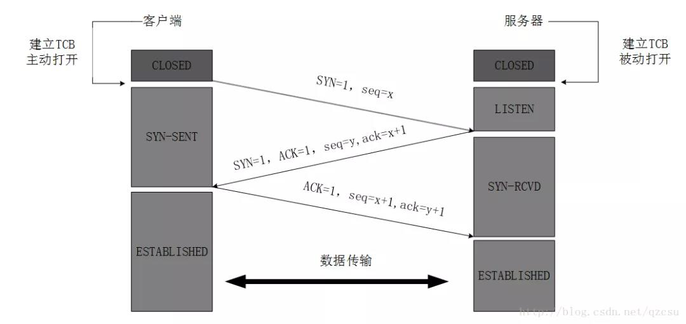
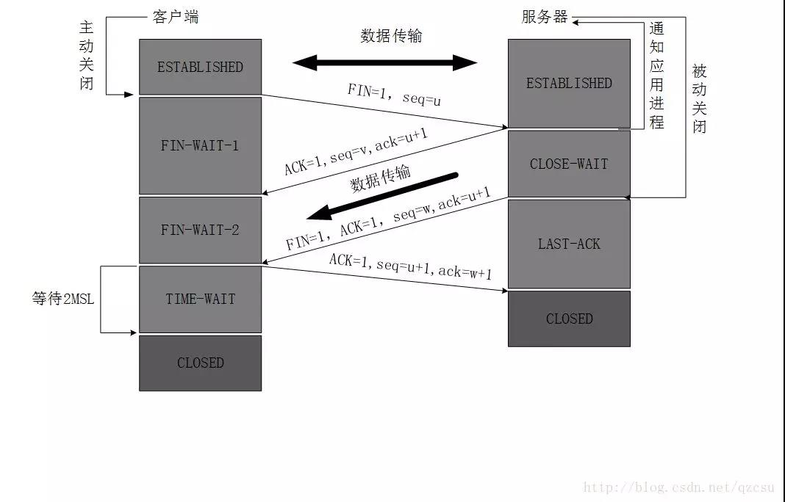

### TCP 

三次握手

TCP服务器进程先创建传输控制块TCB，时刻准备接受客户进程的连接请求 LISTEN状态

TCP客户进程先创建传输控制块TCB，向服务器发送连接请求报文，同步位SYN=1，同时选择一个初始序列号seq=x TCP客户端进入SYN-SENT 同步已发送状态

TCP服务器接收到连接请求报文，如果同意连接，则发出确认报文 ACK=1 SYN=1 ，确认号为 ack=x+1,初始化一个seq=y，服务器进入SYN-RECV 同步收到状态

TCP客户端收到连接确认报文，确认报文的ACK=1，ack=y+1 seq=x+1,客户端连接建立，进入ESTABLISHED连接已建立状态

TCP服务端收到确认报文 进入ESTABLISHED 连接已建立状态

四次挥手

客户端进程发出连接释放报文 报文首部 FIN=1，序列号seq=u 前面传送的数据最后一个字节的序列号+1 客户端进入FIN-WAIT-1状态

服务端收到连接释放报文，发出确认报文， ACK=1 ,ack=u+1 序列号 seq = v,服务端进入CLOSE-WAIT 关闭等待状态，服务端通知上层应用，此时处于半关闭状态。

客户端收到服务断确认请求，客户端进入FIN-WAIT-2终止等待2状态，等待服务断发送连接释放报文 还可以接受服务端发送的数据

服务端将最后的数据发送完毕后，向客户端发送连接释放报文 FIN=1 ack=u+1 seq=w 服务端进入LAST-ACK 最后确认状态

客户端收到服务器的连接释放报文，发出确认ACK=1 ack=w+1 seq = u+1,客户端进入TIME-WAIT 时间等待状态 经过2*MSL(最长报文段寿命后)，撤销相应的TCB后，进入CLOSED关闭状态

服务端收到客户端发送的确认报文，进入CLOSED关闭状态 ，撤销TCB，关闭连接

